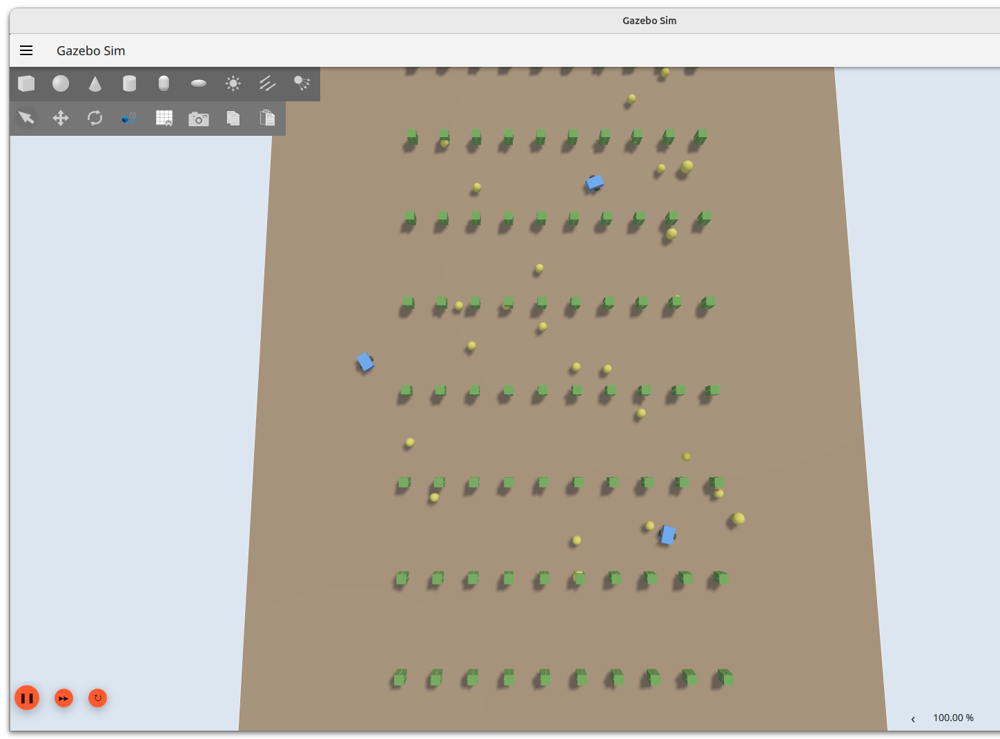
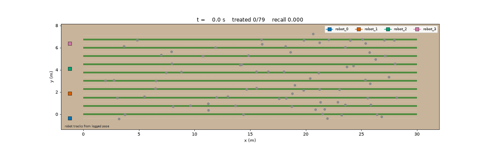

# AgriSwarm-Sim

Four autonomous robots weed a crop field. Each owns a block of lanes — the gaps
between crop rows — and sweeps them end to end. When a detector reports a weed,
it goes to auction: every robot bids, one wins, and the winner interrupts its
sweep to treat it, then resumes where it left off. Robots cannot drive onto a
crop row, so they stop alongside and spray laterally. Cross-lane work routes
via the headland.

The study ablates the bid function: a greedy nearest-robot baseline against
bidding on state of charge and predicted energy cost, over 120 simulated
missions.

ROS 2 Jazzy, Gazebo Harmonic, Ubuntu 24.04. Simulation only.



*Four robots sweep the field; three are in frame here. Green: crop rows. Yellow: weeds. Blue: robots. A robot cannot enter a row, so
it stops in the adjacent lane and sprays sideways.*



*The same kind of run replayed from its own logs. Weeds turn green as they are
treated, robot tracks come from logged pose, and the title carries live recall.
Gazebo shows the physics; this shows the allocation.*

---

## Result

### The bid function was not doing what it was named for

The second arm was called `confidence_energy` and was meant to weight bids by
detector confidence. Its utility is

```
U_i = c_t^γ · SoC_i / (E_i + 1)
```

`c_t` is a property of the task, not of the bidder. Within one auction every
robot bids on the same task, so every bid carries the same factor and it
cancels out of the `argmax`. Two robots keep their relative ranking at any
confidence. `conf_gamma` does not help — raising a shared factor to a power
leaves it shared.

Confidence still gates *whether a task exists*, through
`treat_confidence_threshold`. It never decided *who serviced it*.

So the ablation compares a **greedy nearest-robot baseline** against
**state-of-charge and energy-cost bidding**, and never compared anything
confidence-aware. The mode is now called `energy_aware`, and the invariance is
pinned by `test_energy_aware_ranking_ignores_task_confidence` in
`src/agri_swarm_allocation/test/test_utility.cpp` so it cannot drift back
unnoticed.

Run directories and `results.csv` rows produced before the rename still say
`confidence_energy`; `parse_bid_mode` accepts it as an alias so old artifacts
stay readable.

### No detectable difference between the two bid functions

Under either a slack or a binding energy constraint. Paired by seed, completed
runs only.

| condition | seeds × reps | `total_energy_j` Δ | 95% CI | recall Δ | 95% CI |
|---|---|---|---|---|---|
| A — 22 kJ pack, reserve gate never fires | 20 × 2 | −799 J | [−2444, +847] | −0.0022 | [−0.023, +0.019] |
| B — 16 kJ pack, gate fires near end of mission | 10 × 2 | +1273 J | [−739, +3285] | +0.0044 | [−0.023, +0.032] |

Δ is `energy_aware` minus `distance`, on a mean total of ~50 kJ. Both intervals
straddle zero, the signs disagree between conditions, and seed-level win counts
(14/20 and 4/10 on energy) are what coin flips look like.

What this does **not** say is that the policies are equivalent. Condition A is
compatible with anything from a 5% energy saving to a 2% increase. It says the
experiment cannot distinguish them at this sample size: the sd of the paired
per-seed difference is 3755 J, so detecting an effect the size of the one
observed at 80% power would take roughly 174 paired seeds rather than 20. If
equivalence is the question, it needs a pre-declared margin — say |ΔE| < 5% —
and a test that the interval falls inside it.

Recall ran 0.56–0.84 across the batch, typically ~0.72. Every completed run
finished all four lane sweeps.

This is reported as a null because it is one. An effect found by tuning until
one appears is worth less than an honest negative with its interval attached.

### Reproducing the table

Both result sets are in the repository, and every figure above comes out of
them:

```bash
python3 analysis/compare_modes.py results/slack_22kj.csv
python3 analysis/compare_modes.py results/binding_16kj.csv
python3 analysis/compare_modes.py results/slack_22kj.csv --per-seed
```

`results/*.csv` are `run_batch.py` output: one row per run, appended, with
retried cells appearing more than once. `compare_modes.py` filters on
`status == ok`, averages repeats within each (seed, mode) cell, then pairs by
seed — unpaired means would be swamped by which seeds happened to land where.
The `bid_mode` column reads `confidence_energy` in these files because they
predate the rename; the script normalises it.

### Three things that came out of getting there

**Contention is zero, and that is evidence rather than an assumption.** Over a
representative mission: 160 awards across 160 distinct (task, round) pairs,
mean 4.03 bids per award, minimum 4. Zero conflicting award rounds, zero
re-announcements, zero abandonments. On single-machine loopback DDS with
reliable QoS, every robot bids on every task and exactly one wins, every time.
Split-brain is measured from the award stream — two awards for one (task,
round) naming different winners — so it does not depend on any allocator
noticing the conflict. `analysis/score_run.py` reports incidence and detection
coverage separately for exactly that reason.

**Mission energy was estimated at 1.6 kJ per robot and measured at 11–19 kJ.**
The estimate had never been probed. About 90% of distance travelled is
discretionary detour rather than lane sweeping: in one run a robot covered
1406 m against a lane length of roughly 100 m. That is the real cost of
interrupt execution, and it is also what gives the bid function something to
act on.

**Robots never crossed a crop row.** Across two runs and over 16,000 logged
poses, zero in-field poses fall between lanes. Every off-lane pose is at the
headland (x < 0 or x > 30), where lateral movement is legal. This was the one
safety-shaped claim in the design, and it now rests on measurement rather than
on the geometric argument alone.

---

## Design decisions on record

| Decision | Why |
|---|---|
| **ROS 2 Jazzy + Gazebo Harmonic (Ubuntu 24.04)** | Gazebo Classic reached EOL in January 2025, and Jazzy does not run on 22.04. |
| **No cameras. Detection is a seeded noise model.** | Rendering dominates gz-sim cost and is what would make a larger swarm infeasible. A colour threshold applied to markers you placed yourself is a lookup table with extra steps. `gz-sim-sensors-system` is not loaded at all. |
| **Custom 90-line diff-drive robot, not TurtleBot3** | TB3's value was its sensor suite. With the camera gone that value is gone, and TB3 on Jazzy/Harmonic was the stack's largest dependency risk. |
| **Interfaces before nodes** | The auction protocol started as one vague line of intent. Writing the messages first forced bid deadlines, rounds, and tie-breaking to be decided up front instead of surfacing later as race conditions. |
| **World is generated, not authored** | `generate_field.py --seed N` is a pure function: same seed, byte-identical SDF and ground truth. This is what makes a 20-seed harness possible rather than a retrofit. |
| **Allocator in C++, ablation in one header** | The whole comparison lives in `utility.hpp` with 840 assertions behind it, and a test forbids any other file from branching on the mode. That constraint is what made the rank-invariance visible: with the utility in one place, it is four lines to read and check. |
| **Interrupt execution, not two-pass** | Two-pass makes allocation a static assignment solved with complete information. Under that, both bid modes converge and the ablation shows nothing by construction. |
| **Robots never drive to a weed** | 54 of 79 weeds sit on a crop row. The outer wheel track (0.34 m) cannot enter a 0.22 m row from a lane 0.375 m away. Treating means driving along the lane to the weed's x and spraying sideways. |
| **Run status comes from the log, not the exit code** | Nodes lose races against context teardown and exit 1 on runs that completed perfectly; a run truncated by the mission timeout exits 0. `mission complete` in the log is the only reliable signal. |

## Two things the original plan got wrong

**"≥40% reduction in simulated herbicide vs. blanket spraying" is arithmetic,
not a result.** If weed patches cover fraction *p* of the field, targeted
treatment uses *p* plus false positives. At realistic densities that is an
80–95% reduction the moment anything works at all — reachable with a hardcoded
waypoint list and no swarm. The defensible output is a curve: weeds treated
against false positives, swept over the treatment confidence threshold.

**"Faster or comparable time-to-95%-coverage vs. distance-only auction" set up
a comparison the baseline was likely to win.** Nearest-robot bidding minimises
immediate travel for the task in front of it; any deviation from it pays travel
to buy something else. It is *not* globally optimal — with queues, routing and
dynamic arrivals, greedy nearest assignment minimises neither total travel nor
makespan — but it is a strong baseline to beat on time. As measured, neither
arm wins.

---

## Layout

```
src/agri_swarm_msgs/          6 interfaces: the auction protocol, pinned down
src/agri_swarm_core/          detector, field generator, executors, run logger
src/agri_swarm_allocation/    C++ decentralized auction — the core contribution
src/agri_swarm_description/   diff-drive robot, no camera
src/agri_swarm_bringup/       namespaced N-robot launch, with mission shutdown
analysis/score_run.py         offline scorer, threshold sweep, contention
analysis/compare_modes.py     the paired ablation table, from committed results
analysis/replay.py            top-down animation of a run, from its own logs
scripts/stage_field.py        dressed world for screenshots and video
experiments/run_batch.py      (seed × bid_mode × repeat) runner, resumable
experiments/configs/          experiment defaults
results/                      the 120 runs behind the table above
docs/                         the figures in this file
```

## Run it

```bash
source /opt/ros/jazzy/setup.bash        # build shell: this only
colcon build
source install/setup.bash

python3 -m agri_swarm_core.generate_field --seed 0 --out $HOME/agri-worlds

ros2 launch agri_swarm_bringup swarm.launch.py \
    n_robots:=4 seed:=0 world_dir:=$HOME/agri-worlds \
    energy_capacity_j:=16000 \
    treatments_csv:=$HOME/agri-runs/base/treatments.csv \
    use_allocator:=true headless:=true
```

Missions end themselves: every executor publishes `mission_idle`, and the run
logger shuts the graph down once all of them have held idle for
`quiet_period_s`. A full mission is about 2000 simulated seconds; wall clock
was 285–540 s across 120 headless runs on a 16-thread laptop, and depends on
hardware and real-time factor.

Swap `bid_mode:=distance` for the ablation baseline. That is the only change
required between the two arms — if it ever isn't, the ablation has leaked out
of `utility()` and the comparison is no longer clean.

The whole grid, resumable and unattended:

```bash
python3 experiments/run_batch.py \
    --bid-modes distance energy_aware --repeats 2 \
    --treat-threshold 0.5 --timeout 2400 --energy-capacity 16000 \
    --out ~/agri-runs/batch
```

It reaps stray processes between runs, generates missing fields, scores each
run inline, judges success from the log, and skips cells already recorded `ok`
when re-run. Interrupt it and start it again; it picks up where it stopped.

## Visualising a run

Gazebo shows the physics. It does not show the allocation, and from far enough
away to see four robots on a 30 m field they are specks. `analysis/replay.py`
animates a finished run top-down from its own CSVs — weeds turning grey to
green as they are treated, robot tracks from logged pose, a line from each
award to its winner, and a live recall counter.

```bash
python3 analysis/replay.py \
    --lanes $HOME/agri-worlds/lanes_0.csv \
    --ground-truth $HOME/agri-worlds/ground_truth_0.csv \
    --treatments $HOME/agri-runs/base/treatments.csv \
    --out docs/sweep_distance.gif --speed 50 --fps 15 --trail-s 45
```

For screenshots, `scripts/stage_field.py` writes a second world with the same
lane and weed geometry but throttled to real time, with shadows, a trimmed
ground plane, and crop rows drawn as plant clumps. Never run experiments
against it — at 1× a mission takes hours.

```bash
python3 scripts/stage_field.py --seed 0 --demo-seed 99
ros2 launch agri_swarm_bringup swarm.launch.py \
    n_robots:=4 seed:=99 world_dir:=$HOME/agri-worlds headless:=false
```

The second arm of the ablation, same seed and capacity:


## Tests

259 pytest cases and 840 C++ assertions, all runnable on a machine with **no
ROS 2 installed**. Everything verifiable without a simulator is verified
without one, so the untested surface is exactly the ROS plumbing.

```bash
g++ -std=c++17 -Wall -Wextra -Wpedantic -Werror \
    -Isrc/agri_swarm_allocation/include \
    src/agri_swarm_allocation/test/test_utility.cpp -o /tmp/test_utility && /tmp/test_utility

python3 -m pytest tests/ -q
```

Three of these are guard rails rather than unit tests, and they matter most:

- the allocator package must contain no reference to `ground_truth` or
  `patch_id` — if the bidding path ever reads the oracle, the experiment is
  invalid rather than merely wrong;
- nothing outside `utility.hpp` may branch on `bid_mode` — if the ablation
  leaks into a second file, the two arms differ by more than one function and
  the comparison is void;
- the `energy_aware` ranking between two bidders must not change with task
  confidence — the property that turned out to define what this ablation
  actually measures.

CI (`.github/workflows/ci.yml`) runs both suites, a syntax and manifest check,
and a fourth job that builds the workspace in a ROS 2 Jazzy container:
`rosdep install` from the manifests, `colcon build`, an import of the generated
interfaces, and `ros2 launch --show-args`. That last set exists because the
ROS-free jobs cannot catch an undeclared dependency or a message that stopped
generating. It does not launch Gazebo — a smoke launch that passes says nothing
about a 2000-second mission. Green means the maths is right and the workspace
builds clean from a checkout.

## Scoring and run budget

`analysis/score_run.py` joins a treatment log against `ground_truth_<seed>.csv`
and sweeps the treatment confidence threshold **offline**. One simulated run
per cell at the lowest threshold yields the whole curve — the difference
between ~560 runs and 40.

Threshold is therefore not a sweep axis. Repeats are: run-to-run variance is
large enough that a single run per cell cannot separate a bid-mode effect from
noise.

```bash
python3 analysis/score_run.py \
    --ground-truth $HOME/agri-worlds/ground_truth_0.csv \
    --treatments $HOME/agri-runs/base/treatments.csv \
    --out-contention $HOME/agri-runs/base/contention.csv
```

Two caveats, both load-bearing. `mission_time_s` and `total_energy_j` depend on
the threshold and are valid only at the one actually simulated; treatment
counts and derived precision/recall are valid across the sweep. And the offline
sweep is a filter, not a counterfactual: the system is closed loop, so a task
that existed at threshold 0.5 changed where its robot went, which changed what
it later saw. Reading the curve at 0.8 is not the same as having run at 0.8.
The ablation itself is unaffected — every run in it executed at a fixed
threshold of 0.5 — but the curve should be read as an indication, and a
threshold study worth reporting would simulate each threshold directly.

## Limitations

- **Confidence gates task creation, not allocation.** See the first result
  above. Making the auction genuinely confidence-aware needs confidence to
  enter asymmetrically — per-robot detection estimates, or an expected-value
  formulation that trades benefit against cost — and a re-run.
- **Contention is structurally absent.** Loopback DDS with reliable QoS loses
  nothing, so split-brain and re-announcement rates are zero by construction
  rather than by protocol quality. The re-announcement and concession machinery
  is implemented but not experimentally validated. Producing non-zero rates
  needs induced faults — `fail_robot`, or a lossy QoS profile — reported as a
  separate fault-condition study.
- **The energy budget is reserve-gated, not a hard battery.** The allocator
  refuses new work below the reserve fraction, but nothing forces a robot to
  stop or return at zero, and committed future tasks are not reserved against.
  "Binding constraint" above means the gate fires, not that the robot dies.
- **Repeats share a detector seed.** The detector RNG is keyed on field seed
  and robot id, not on the replication index, so the two repeats within a cell
  see correlated noise. They still differ — scheduling jitter propagates
  through detour ordering, which is most of the observed variance — but they
  are not clean Monte Carlo replications, and the reported sd is therefore a
  lower bound on true run-to-run spread.
- **Task identity is a spatial hash.** At `task_cell_size` 0.30, 21.3% of
  paired sightings of one weed hash to different task IDs, and two genuine
  weeds can occasionally share a cell. So `redundant_treatments` measures grid
  fragmentation more than allocation quality, and the hash should not be
  mistaken for data association. The floor is reported rather than tuned away.
- **`travel_cost_m` is Euclidean.** `submitBid` uses `std::hypot`, which for a
  task two lanes over reports a straight line through crop rows. Both bid modes
  are wrong identically, so the comparison survives, but cross-lane awards are
  costed optimistically.
- **Idle draw has a units error.** The standby term integrates against
  simulated seconds; observed draw is ~1.07 W against a documented 0.2 W. It
  reaches ~2.5 kJ on a long mission, which biases slower runs.
- **Configuration lives in two places, and the file says which.**
  `experiments/configs/base.yaml` holds what `run_batch.py` reads; everything
  else — detector noise, energy constants, timeouts — lives in node parameter
  declarations and launch arguments, recorded under `node_defaults` in that
  file as documentation rather than as settings. Editing a `node_defaults`
  value changes nothing. The authoritative settings for any published run are
  in the `command` column of `results/*.csv`.
- **Field bounds derive from weed extent rather than the lanes file**, in both
  the executor and the scorer, so a few legitimate edge detections are
  discarded and robots occasionally overshoot the headland margin chasing a
  task that should have been rejected at award time.
- **Sim-only, and the simulator is frictionless.**
  `gz::sim::systems::DiffDrive` has no slip model, so its odometry is ground
  truth. Measured lateral error (3.4e-5 m over 1178 m) characterises the
  simulator, not the controller. The 9.5 cm per-side lane clearance is a
  geometric bound, verified against logged pose but not against pose noise.

## Licence

Apache-2.0. See [LICENSE](LICENSE).